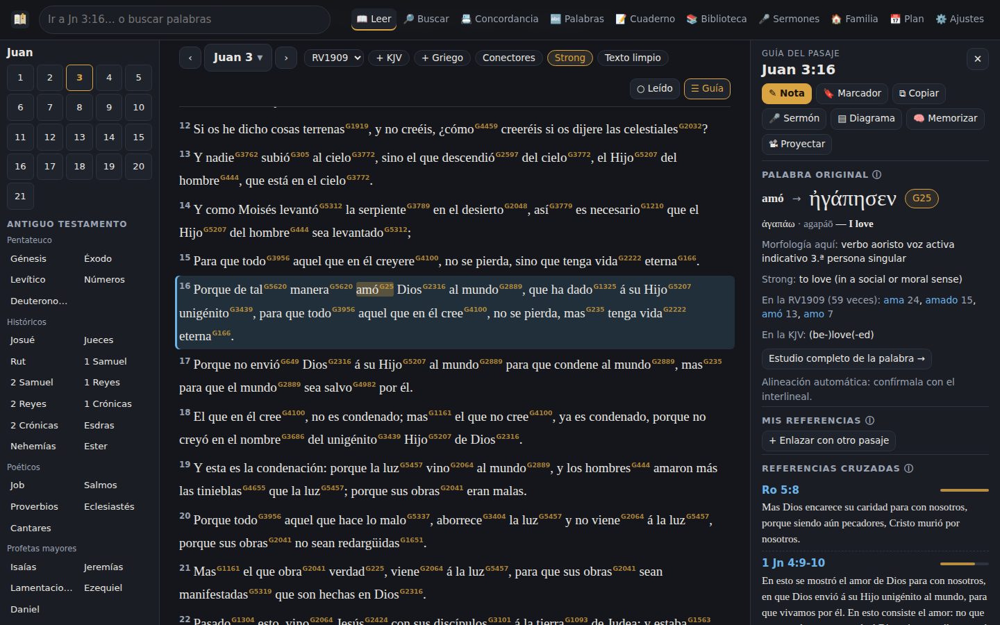
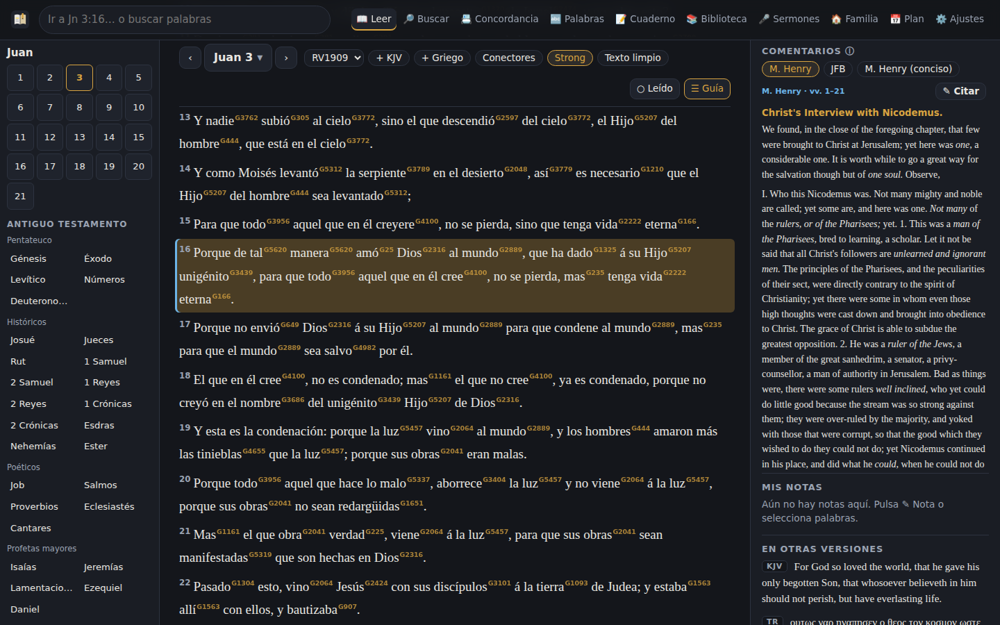
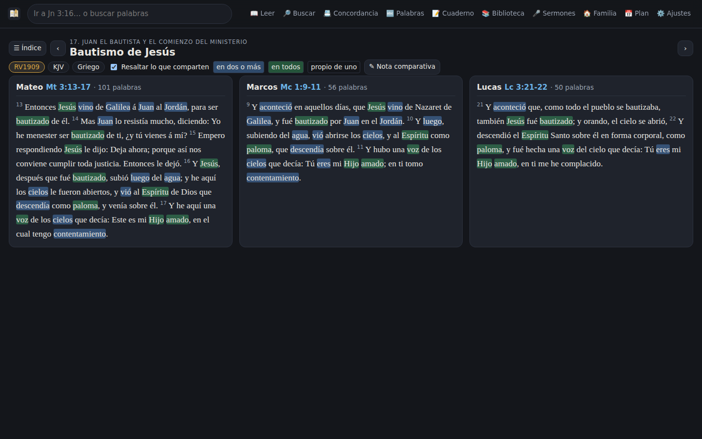
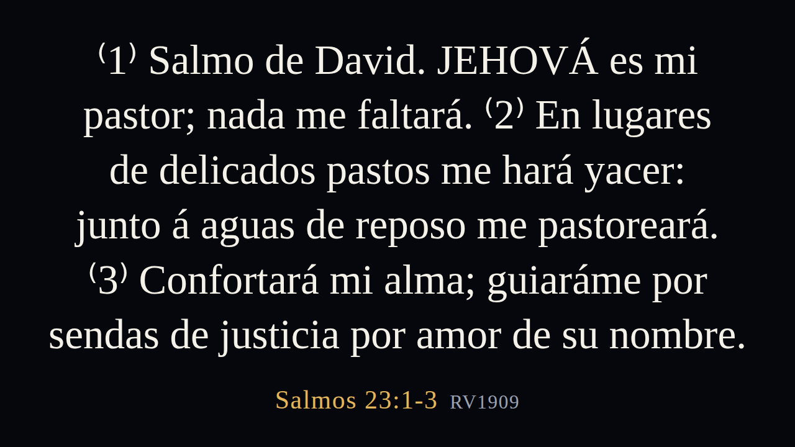

# Estudio Bíblico

App de estudio de la Biblia, pensada como un Logos sencillo y en español:
**texto bíblico con versiones en paralelo, referencias cruzadas, notas,
resaltados a nivel de palabra, búsqueda, estudio de palabras y planes de
lectura**. No necesita cuenta, servidor ni internet: todo se guarda en tu
dispositivo.

## Cómo abrirla

1. Instala **Node.js** (versión LTS) desde https://nodejs.org — solo una vez.
2. Descarga el proyecto: en GitHub, botón verde **Code → Download ZIP**
   (en la rama `claude/bible-study-app-notes-28wpxd`) y descomprímelo.
3. Doble clic en **`Estudio Biblico (Windows).bat`** o, en Mac,
   **`Estudio Biblico (Mac).command`** (la primera vez: clic derecho → Abrir).
   Se abre el navegador en la app. Deja abierta la ventana negra mientras la usas.

Desde la terminal es lo mismo:

```bash
npm start            # desde la raíz del repositorio
```

y entra a **http://localhost:8080/biblia/** (si el 8080 está ocupado, la
ventana dice qué puerto usó: 8081, 8082…). Debe abrirse por `http://`, no con
doble clic en `index.html`: el navegador bloquea la app desde `file://`.

Se puede instalar como app (Chrome/Edge/Android: "Instalar"; iPhone:
Compartir → "Añadir a pantalla de inicio") y funciona sin conexión. También se
puede publicar tal cual en GitHub Pages: son archivos estáticos.

## Qué incluye

| Pantalla | Para qué sirve |
| --- | --- |
| **Leer** | El texto en Reina-Valera 1909, con KJV, hebreo (AT) o griego (NT) en columnas paralelas. Navegador de libros y capítulos, capítulo anterior/siguiente con ← →, modo párrafo o un versículo por línea. |
| **Introducción a cada libro** | Los 66 libros con autor, fecha, destinatarios, género, propósito, tema, versículo clave, estructura enlazada, cómo apunta a Cristo y los debates críticos principales. En la guía de cada capítulo y en `#/libro/45`. |
| **Guía del pasaje** | Al tocar un versículo: tus referencias propias (enlaces entre pasajes con la razón, en ambos sentidos), sus referencias cruzadas con el texto a la vista (ordenadas por votos), tus notas, el mismo versículo en las otras versiones y sus palabras para estudiarlas. |
| **Resaltar y subrayar** | Selecciona cualquier fragmento (de una palabra a varios versículos) y elige entre 6 colores, subrayado o negrita. La goma (⌫) borra solo la parte seleccionada. Ctrl+Z deshace. |
| **Notas** | Sobre un versículo, un rango o un capítulo, o apuntes libres (bosquejos, sermones). Markdown sencillo, etiquetas (`#gracia`), y las citas que escribas ("ver Ro 5:8") se vuelven enlaces con vista previa al pasar el cursor. |
| **Buscar** | En toda la Biblia o por testamento, sección o libro: palabras, `"frase exacta"`, `amor|caridad`, `justific*` y `-excluir`. Sin distinguir tildes. Gráfico de resultados por libro. |
| **Concordancia** | Índice alfabético de las 27 000 palabras distintas de la RV1909 (o de la KJV) con su frecuencia, filtro por letra, las más frecuentes y los hápax. Cada palabra muestra todas sus apariciones en una línea con el contexto a ambos lados, ordenables por orden bíblico o por la palabra que sigue o precede; forma exacta, todas las formas o frase; filtro por testamento, sección o libro; distribución, formas, palabras que la acompañan y vecinas en el índice. Se descarga en texto o se imprime. |
| **Palabras** | Estudio de una palabra: apariciones, libros y secciones donde se concentra, primera y última mención, y con qué palabras suele aparecer. |
| **Cuaderno** | Todas tus notas (con buscador y filtro por etiqueta y libro), tus resaltados por color y tus marcadores. Exporta tus notas a Markdown. |
| **Plan** | Planes de lectura (Biblia en un año, NT en 90 días, evangelios, Salmos, cartas de Pablo…), lectura de hoy, racha, y un mapa de los 1189 capítulos con lo que ya leíste. |
| **Marcado** | Además del resaltado: color de letra, subrayado doble u ondulado, tachado, recuadro, círculo, negrita, cursiva y 25 símbolos del estudio inductivo (△ Dios, ✝ Cristo, ☁ Espíritu, ▣ pacto…). Se combinan sobre el mismo texto. |
| **Palabras clave** | Marca una palabra una vez ("pacto" en rojo con ▣) y aparece marcada en todo el libro o toda la Biblia. Se agrupan en juegos que se encienden y apagan. El botón **Conectores** marca solo los conectores lógicos (causa, conclusión, propósito, contraste, condición, comparación, tiempo) para seguir el argumento, y **Texto limpio** oculta todas las marcas. |
| **Biblioteca** | Importa tus libros (EPUB, Word, HTML, Markdown, texto). La app indexa cada cita bíblica y la Guía del pasaje muestra "En tu biblioteca": qué dice cada libro del versículo que estudias. |
| **Diagrama de bloques** | Análisis estructural de un pasaje: el texto partido en cláusulas, la principal a la izquierda y las dependientes sangradas, con la relación lógica (causa, inferencia, propósito, medio, contraste, concesión…) sugerida por los conectores. Partir, unir, sangrar con Tab, notas por línea; se lleva al sermón con un bosquejo sugerido. |
| **Sermones** | Taller en 9 pasos (texto, exégesis, idea exegética, tres preguntas, propósito, idea homilética, bosquejo, introducción y conclusión, revisión) con avisos de revisión, duración estimada, banco de ilustraciones, cobertura del canon, exportación, **hoja para la congregación** (bosquejo con espacios para llenar y preguntas de observación, interpretación y aplicación para grupos pequeños) y **modo púlpito** con cronómetro. |
| **Memorizar** | Versículos para memorizar con repetición espaciada (cajas de Leitner: 1, 3, 7, 14, 30 y 90 días), pistas de iniciales o huecos, escribir de memoria y comprobar. Se agregan desde la Guía del pasaje o los devocionales. |
| **Familia** | Devocionales para hijos (con versión para pequeños y adolescentes), esposa, esposo y pareja; diario de respuestas y peticiones, racha, lectura en voz alta e impresión. |
| **Idiomas originales** | Columna hebrea (OSHB) o griega (SBLGNT) donde cada palabra se toca para ver lema, número Strong, morfología explicada en español con notas exegéticas (aoristo, wayyiqtol, piel…), definición y traducciones. Modo **interlineal** con transliteración, glosa y código bajo cada palabra. Concordancia completa por número Strong (`H2617`, `G26`), con formas, morfología y distribución por libro. |
| **Comentarios clásicos** | En la Guía del pasaje, lo que dicen **Matthew Henry** (completo y conciso) y **Jamieson-Fausset-Brown** del versículo que estudias (en inglés), con sus citas enlazadas y "✎ Citar" para guardar un párrafo en tus notas. La Guía del capítulo muestra la introducción del comentario y el índice de sus secciones. |
| **RV1909 con Strong** | El botón **Strong** pone el número Strong sobre cada palabra de la RV1909 (amó<sup>G25</sup>). Al tocar la palabra se ve el hebreo o griego que traduce, su morfología en ese versículo, la definición y cómo la traduce la RV1909 en toda la Biblia. La alineación es automática (ver abajo): conviene confirmarla con el interlineal. |
| **Armonía de los evangelios** | `#/armonia`: 194 perícopas en orden cronológico. Cada suceso se compara en columnas (Mateo, Marcos, Lucas, Juan) en RV1909, KJV o griego, con las palabras compartidas resaltadas (en griego por lema) y lo propio de cada evangelista sin resaltar. La Guía del pasaje muestra los paralelos del versículo. |
| **Proyección** | "📽 Proyectar" abre una segunda ventana para el proyector o el televisor (en Chrome, directamente en la otra pantalla). Los pasajes se parten en diapositivas y la letra se ajusta sola; en el modo púlpito, el texto y cada punto se proyectan al avanzar. Barra de control con anterior/siguiente y pantalla en negro; en el proyector: ← → cambiar, B negro, T tema (noche, azul, claro, croma verde), F pantalla completa. |
| **Ajustes** | Tema oscuro, claro o sepia; tamaño y tipo de letra; versiones; umbral de votos de las referencias; exportar e importar un respaldo. |

La caja de arriba entiende citas en español: `Jn 3:16`, `1 Co 13`,
`Primera de Corintios 13:4`, `sal 23`, `Ro 8:28-9:1`, `Judas 3`. Si no es una
cita, busca las palabras. Atajo: `/`.

## Textos y datos

| Dato | Fuente | Licencia |
| --- | --- | --- |
| Reina-Valera 1909 | scrollmapper/bible_databases | Dominio público |
| King James Version (1769) | scrollmapper/bible_databases | Dominio público |
| Códice de Leningrado (hebreo, AT) | scrollmapper/bible_databases | Dominio público |
| Textus Receptus (griego, NT) | scrollmapper/bible_databases | Dominio público |
| Hebreo con lemas y morfología | [Open Scriptures Hebrew Bible](https://github.com/openscriptures/morphhb) | WLC: dominio público; análisis: CC-BY 4.0 |
| Griego SBLGNT con análisis | [MorphGNT](https://github.com/morphgnt/sblgnt) | Texto: licencia SBLGNT; análisis: CC-BY-SA |
| Diccionarios de Strong | [Open Scriptures](https://github.com/openscriptures/strongs) | Dominio público (edición JSON CC-BY-SA) |
| Léxico griego de Dodson | [Biblical Humanities](https://github.com/biblicalhumanities/Dodson-Greek-Lexicon) | Dominio público |
| ~200 000 referencias cruzadas | [OpenBible.info](https://www.openbible.info/labs/cross-references/) | CC-BY |
| Matthew Henry (completo y conciso), Jamieson-Fausset-Brown | [CrossWire Bible Society](https://gitlab.com/crosswire-bible-society) (módulos OSIS) | Dominio público |
| Números Strong de la RV1909 | Alineación propia (`tools/biblia-strong.mjs`) sobre los textos de arriba | Igual que sus fuentes |

La Reina-Valera 1960 tiene derechos de autor (Sociedades Bíblicas Unidas), por
eso no viene incluida.

Los datos ya generados están en `biblia/datos/`, partidos por libro para que
abrir un capítulo solo descargue ese libro. Para regenerarlos:

```bash
npm run biblia:datos                        # descarga las fuentes de GitHub
node tools/biblia-datos.mjs ./mis-fuentes   # o usa copias locales
node tools/biblia-originales.mjs            # hebreo y griego con morfología y léxicos
npm run biblia:comentarios                  # Matthew Henry y JFB desde CrossWire
npm run biblia:strong                       # alinea la RV1909 con los números Strong (~1 min)
```

**Cómo se alinea la RV1909 con Strong.** No existe una RV1909 etiquetada de
dominio público, así que `tools/biblia-strong.mjs` la aprende de los propios
textos: el hebreo (OSHB) y el griego (SBLGNT) llevan un número Strong en cada
palabra, y un modelo estadístico de traducción (IBM Model 1 con EM) descubre
qué palabra española corresponde a cada palabra original, versículo por
versículo (probando la numeración hebrea cuando difiere, como en Joel o
Malaquías). Se numeran las palabras de contenido (un 34 % del texto); las
gramaticales (de, la, que…) y las dudosas quedan sin número.

## Estructura

```
biblia/
  index.html, sw.js, manifest.webmanifest, assets/
  datos/            texto por versión y libro, referencias cruzadas, índice,
                    com/ (comentarios), rvs/ (Strong de la RV1909)
  proyector.html    la ventana que se ve en el proyector
  biblioteca/       libros incluidos con la app (ver su README)
  docs/             100 ideas profesionales para las próximas versiones
  src/
    libros.js       los 66 libros, ids de versículo (Juan 3:16 = 43003016)
    referencias.js  leer y escribir citas en español, detectarlas en un texto
    marcas.js       resaltados a nivel de carácter, que cruzan versículos
    notas.js        Markdown seguro, etiquetas, filtros, exportar
    busqueda.js     consultas, concordancia y estudio de palabras
    plan.js         planes de lectura repartidos por versículos
    claves.js       palabras clave marcadas en automático
    biblioteca.js   lectura de EPUB/Word/HTML e índice de citas de tus libros
    estante.js      los libros en IndexedDB
    sermones.js     flujo homilético, duración, avisos, exportación
    devocionales.js devocionales para la familia
    morfologia.js   códigos morfológicos hebreos y griegos explicados en español
    concordancia.js concordancia: índice alfabético, líneas con contexto y por número Strong
    diagrama.js     diagrama de bloques: cláusulas, sangría y relaciones lógicas
    introducciones.js introducción a los 66 libros
    memoria.js      repetición espaciada para memorizar versículos
    comentarios.js  Matthew Henry y JFB por versículo
    strongs.js      números Strong de cada palabra de la RV1909
    armonia.js      armonía de los evangelios (194 perícopas) y palabras comunes
    proyeccion.js   diapositivas y control de la segunda pantalla (proyector.html)
    texto.js        carga de datos y referencias cruzadas
    almacen.js      tus datos en localStorage, deshacer, respaldo
    vistas/         pantallas (lector, buscar, palabra, cuaderno, plan, ajustes)
```

Las pruebas (`npm test`) cubren el analizador de citas, los resaltados, la
búsqueda, las notas, los planes y la integridad de los datos.

## Capturas

| | |
| --- | --- |
|  |  |
|  |  |

Más en [`docs/capturas/`](docs/capturas/).
